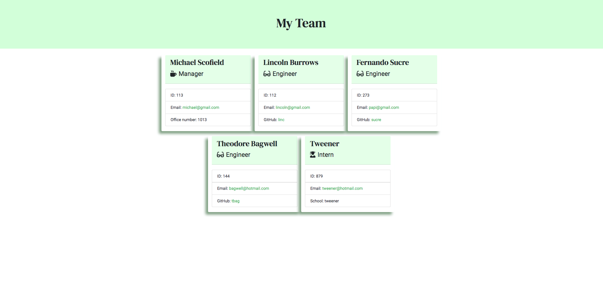

# Team Profile Generator
[](https://opensource.org/licenses/MIT)

## Table of Contents
- [Description](#description)
- [Installation](#installation)
- [Usage](#usage)
- [License](#license)
- [Contributing](#contributing)
- [Tests](#tests)

## Description
A command line application that generates an HTML file displaying profiles for each member of the team based on information provided by the user.
As this application currently targets software engineering teams, profiles can be created for team members with the role of Manager, Engineer, or Intern.
Users can input any number of team members, and on completion, the profiles will be rendered onto a very cute web page.

## Installation
Clone or download the package and open terminal in the package directory. Then run the following command to install all the dependencies into the local node_modules folder:

```
npm i
```

## Usage
After installation, you can then run the following command to run the application:

```
npm start
```

Your generated HTML file will be located in the "output" folder.

The entire run-through of the application + the resulting HTML file will look something like this:


A video version of the full run-through can be found [here](https://github.com/y-ilin/Team-Profile-Generator/blob/master/assets/app-demo.mov).

The resulting web page will look something like:


## License
Licensed under the MIT License.

## Contributing
To contribute directly to the code base, please see this [How to Contribute](https://github.com/Microsoft/vscode/wiki/How-to-Contribute) document.

## Tests
The following command will run unit tests to ensure the classes are built with the desired parameters and methods:

```
npm run test
```


